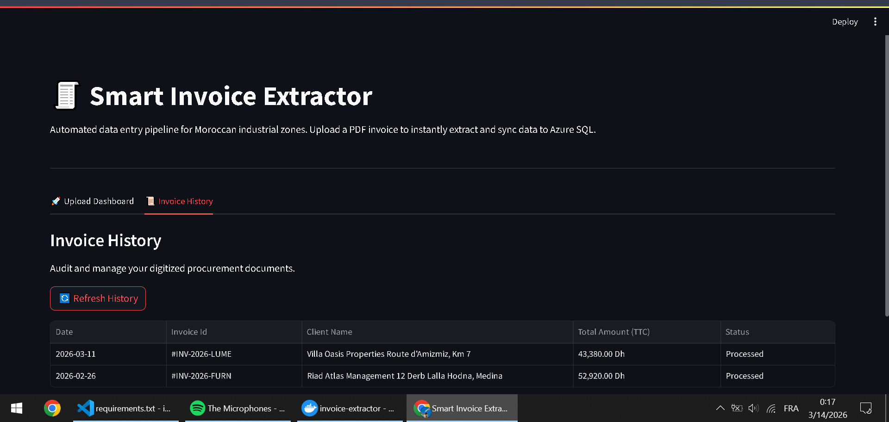
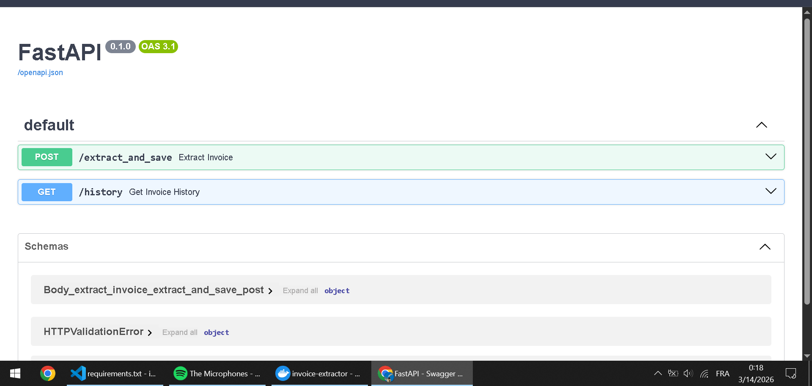
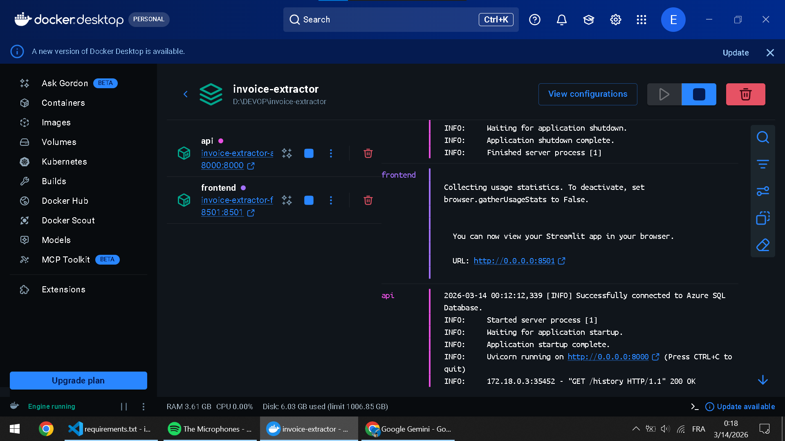

# 🧾 Smart Invoice Extractor (SmartExtract)


## 📌 Executive Summary
An automated, end-to-end Data Engineering pipeline designed to eliminate hours of manual data entry for logistics companies and manufacturing facilities. 


This B2B SaaS tool ingests raw PDF invoices, extracts structured data using high-fidelity parsing, and seamlessly synchronizes the data to a normalized, enterprise-grade Azure SQL Database. The system is built on a modern, fully containerized microservices architecture.

---

## 🚀 Key Features
* **Automated PDF Parsing:** Instantly extracts dynamic fields including Client Information (ICE), Invoice IDs, Dates, Total Amounts (TTC), and granular Line Items.
* **Relational Database Syncing:** Intelligently checks for existing records and auto-upserts Clients, Products, and Invoice Items into a normalized Azure SQL Database with native ON DELETE CASCADE rules.
* **Asynchronous REST API:** Powered by FastAPI for high-performance, concurrent data processing.
* **Interactive Dashboard:** A sleek, responsive Streamlit web interface featuring drag-and-drop uploads and real-time history auditing via Pandas dataframes.
* **DevOps Ready:** Orchestrated with Docker Compose for guaranteed consistency across local and production environments, utilizing isolated internal container networking.
* **Cloud-Native Deployment:** Hosted on an Azure Ubuntu VM, orchestrated with Docker Compose for 24/7 availability and isolated internal container networking.

---

## 📸 Project Showcase

### 1. Interactive Web Dashboard (Streamlit)
*Users simply drag and drop PDF invoices. The system instantly processes the document, displays key metrics, and provides a fully auditable history tab.*


### 2. Auto-Generated API Documentation (c)
*The backend provides fully documented, asynchronous REST endpoints (`POST /extract_and_save` and `GET /history`) for seamless integration with external software.*


### 3. Containerized Architecture (Docker)
*The entire application runs in isolated containers communicating over a private Docker network, independent of the host OS.*


> ---

## 🏗️ System Architecture

The application is split into microservices running within a secure Docker network:
1. **Frontend Service (`frontend:8501`):** A Streamlit container providing the user interface and data visualization.
2. **Backend API Service (`api:8000`):** A FastAPI container handling the business logic, PDF extraction, data cleaning, and database routing.
3. **Database Layer:** A remote, cloud-hosted Azure SQL instance managed via SQLAlchemy ORM.

---

## 📂 Database Schema

The Azure SQL database utilizes a fully normalized relational schema designed for complex querying and BI reporting:
* `Clients` (id, company_name, address, ice_number)
* `Invoices` (id, client_id, invoice_number, date, total_ttc)
* `Products` (id, description, standard_price)
* `Invoice_Items` (id, invoice_id, product_id, quantity)

---

## 💻 Local Setup & Quickstart

### Prerequisites
* **Docker & Docker Compose** installed and running on your machine.
* An active **Azure SQL Database**.
* A `.env` file located in the root directory containing your Azure connection string.

### Installation
1. Clone the repository:
   ```bash
   git clone https://github.com/El-walid/smart-invoice-extractor.git
   cd invoice-extractor

2. Build and launch the container network:
```bash
docker compose up --build

```


## ☁️ Cloud Deployment (Azure VM)

This application is designed to be deployed to a cloud server for production use.
1. Provision an **Ubuntu 22.04 VM** on Azure.
2. Configure the **Network Security Group (NSG)** to allow inbound TCP traffic on port `8501`.
3. SSH into the server and install the Docker engine:
   ```bash
   sudo apt update && sudo apt install docker.io docker-compose-v2 git -y
   ```
4. Clone the repository, manually create the `.env` file with your secure database credentials, and launch the detached container network:
   ```bash
   sudo docker compose up -d --build
   ```

---

## 👤 About the Author

**El Walid El Alaoui Fels** *Data Engineer | Cloud Architect*

Specializing in the Azure Data Platform, DevOps orchestration, and automated Python ETL pipelines. Based in Marrakech, Morocco, and actively taking on projects to help businesses modernize and automate their data infrastructure.

[LinkedIn Profile](https://www.linkedin.com/in/el-walid-el-alaoui-fels-51491538b/)

[Upwork](https://www.linkedin.com/in/el-walid-el-alaoui-fels-51491538b/)
